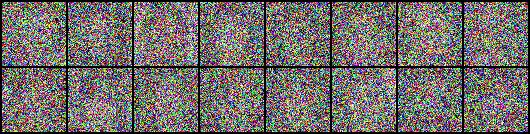
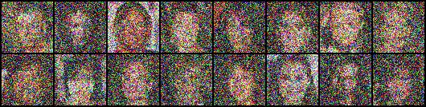

# Diffusion Models

## Run

### Train
```shell
python train.py
```

### Inference
```shell
python inference.py
```

## Result

steps = 0


steps = 500



steps = 750



steps = 1000


## Different Scheduler Results

### DDPM

steps = 1000


### DDIM

steps = 50


## Model Structure (s sample)

